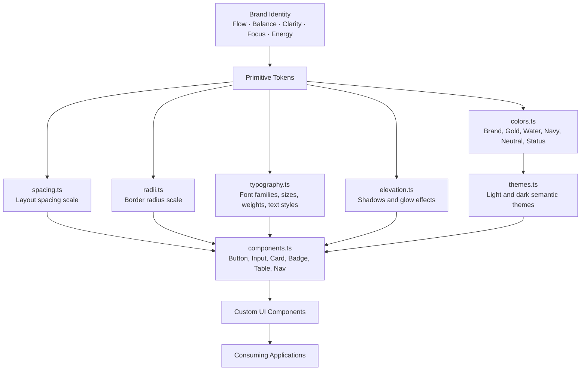
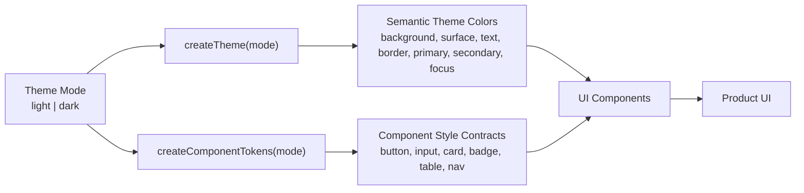
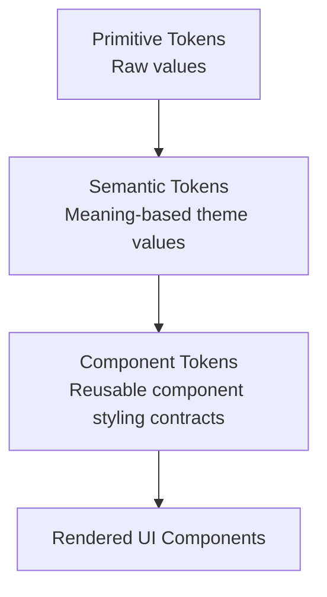

# UI Library Tokens

A brand-driven design token system for custom UI components.

This package defines the shared visual language for the UI library, including colors, spacing, radii, typography, elevation, semantic themes, and component-level styling contracts.

The theme is inspired by a premium visual identity built around flow, balance, clarity, focus, energy, and elevation.

## Brand Direction

The design system is built around a dark-first premium interface style with support for both dark and light themes.

### Core Brand Colors

| Role | Color | Hex |
|---|---:|---:|
| Onyx | Dark foundation | `#0A0A0A` |
| Charcoal | Dark surface | `#1B1E22` |
| Slate | Dark border / muted surface | `#2C3440` |
| Midnight Navy | Deep brand background | `#0B1D3A` |
| Deep Navy | Light theme text / strong background | `#0D1B2A` |
| Electric Water | Interactive focus accent | `#00AFFF` |
| Water Blue | Light theme accent | `#2FA7E2` |
| Champagne Gold | Primary brand action | `#D4AF6A` |
| Warm Sand | Light warm background | `#E6D7B5` |
| Ivory | Light surface / dark text color | `#F7F4EE` |
| Soft Gray | Light border / neutral support | `#D8DDE3` |

## Design Principles

The system follows these visual rules:

- Use **Champagne Gold** for primary brand actions, emphasis, premium UI moments, and active navigation states.
- Use **Electric Water Blue** for focus rings, interactive accents, secondary actions, and energy-driven UI states.
- Use **Onyx, Charcoal, and Midnight Navy** as the dark theme foundation.
- Use **Ivory, Warm Sand, and Soft Gray** as the light theme foundation.
- Use serif typography for brand headings and overlines.
- Use sans-serif typography for functional UI text, controls, labels, and data-heavy interfaces.
- Use elevated cards, subtle borders, and glow effects sparingly to preserve a premium look.

## Directory Structure

```txt
tokens/
  src/
    colors.ts
    spacing.ts
    radii.ts
    typography.ts
    elevation.ts
    themes.ts
    components.ts
    index.ts
```

## Token Architecture



## Theme Interaction Flow



## Component Styling Model

The design system separates tokens into three layers:



### Primitive Tokens

Primitive tokens are raw values.

Examples:

```ts
colors.brand.champagneGold;
spacing.md;
radii.lg;
typography.fontSize.sm;
elevation.glowGold;
```

### Semantic Tokens

Semantic tokens describe intent.

Examples:

```ts
theme.color.background;
theme.color.surface;
theme.color.text;
theme.color.primary;
theme.color.secondary;
theme.color.focus;
```

### Component Tokens

Component tokens describe reusable component styling.

Examples:

```ts
components.button.primary;
components.input.focus;
components.card.elevated;
components.badge.gold;
components.table.header;
components.nav.item.active;
```

## Usage

Import tokens directly from the package.

```ts
import {
  createTheme,
  createComponentTokens,
  typography
} from "@your-scope/tokens";

const theme = createTheme("dark");
const components = createComponentTokens("dark");

export const buttonStyles = {
  ...components.button.base,
  ...components.button.primary,
  fontFamily: typography.fontFamily.sans,
  fontSize: typography.fontSize.sm,
  letterSpacing: typography.letterSpacing.wider
};
```

## Theme Usage

```ts
import { createTheme } from "@your-scope/tokens";

const darkTheme = createTheme("dark");
const lightTheme = createTheme("light");
```

## Component Token Usage

```ts
import { createComponentTokens } from "@your-scope/tokens";

const components = createComponentTokens("dark");

const cardStyles = {
  ...components.card.base,
  ...components.card.accent
};
```

## Text Formatting

Typography is defined in `tokens/src/typography.ts`.

The text system includes:

| Text Style | Purpose |
|---|---|
| `display` | Large brand moments and landing sections |
| `h1` | Page-level headings |
| `h2` | Section headings |
| `h3` | Subsection headings |
| `h4` | Small headings and card titles |
| `body` | Default paragraph copy |
| `bodySm` | Secondary body copy |
| `label` | Form labels and compact UI labels |
| `button` | Button text |
| `caption` | Small helper text |
| `overline` | Premium uppercase brand labels |
| `code` | Inline code and technical content |

Example:

```ts
import { typography } from "@your-scope/tokens";

export const headingStyles = {
  fontFamily: typography.fontFamily.serif,
  fontSize: typography.fontSize["3xl"],
  fontWeight: typography.fontWeight.semibold,
  lineHeight: typography.lineHeight.snug,
  letterSpacing: typography.letterSpacing.wide
};
```

## Recommended Typography Rules

Use the serif family for brand-heavy content:

```ts
typography.textStyles.display;
typography.textStyles.h1;
typography.textStyles.h2;
typography.textStyles.overline;
```

Use the sans-serif family for functional UI content:

```ts
typography.textStyles.body;
typography.textStyles.bodySm;
typography.textStyles.label;
typography.textStyles.button;
typography.textStyles.caption;
```

Use the mono family for developer-facing content:

```ts
typography.textStyles.code;
```

## Component Guidelines

### Button

Primary buttons should use Champagne Gold.

Use primary buttons for:

- Main form submission
- Confirm actions
- Primary page actions
- Brand-forward calls to action

Use secondary buttons for:

- Alternative actions
- Non-destructive supporting actions
- Water/flow-related interactions

Use ghost buttons for:

- Low-emphasis actions
- Toolbar actions
- Sidebar items
- Table row actions

### Input

Inputs use a neutral surface with strong focus visibility.

Focus states should use Water Blue / Electric Water to represent clarity and flow.

### Card

Cards should use subtle borders and restrained shadows.

Use accent cards only when a section needs premium emphasis.

### Badge

Gold badges represent brand, status, premium, or highlighted information.

Water badges represent flow, activity, focus, or informational states.

### Table

Tables should prioritize readability.

Use muted headers, subtle row dividers, and soft hover states.

### Navigation

Active navigation should use a gold-tinted state.

Hover states should remain subtle and avoid overpowering the primary content.

## Accessibility Notes

The theme should preserve clear contrast between text, surfaces, borders, and actions.

Recommended practices:

- Use `theme.color.text` for primary text.
- Use `theme.color.textMuted` for secondary text.
- Use `theme.color.textSubtle` for helper text only.
- Use `theme.color.focus` for visible keyboard focus states.
- Avoid using gold text on light backgrounds without sufficient contrast.
- Avoid using blue glow effects around dense text content.

## Exported API

```ts
export * from "./colors";
export * from "./spacing";
export * from "./radii";
export * from "./typography";
export * from "./elevation";
export * from "./themes";
export * from "./components";
```

## Theme API

```ts
createTheme(mode?: "light" | "dark");
createComponentTokens(mode?: "light" | "dark");
```

## Example: Building a Custom Button

```ts
import {
  createComponentTokens,
  typography
} from "@your-scope/tokens";

type ButtonVariant = "primary" | "secondary" | "ghost";
type ThemeMode = "light" | "dark";

export function getButtonStyles(
  variant: ButtonVariant = "primary",
  mode: ThemeMode = "dark"
) {
  const components = createComponentTokens(mode);

  return {
    ...components.button.base,
    ...components.button[variant],
    fontFamily: typography.fontFamily.sans,
    fontSize: typography.fontSize.sm,
    letterSpacing: typography.letterSpacing.wider
  };
}
```

## Example: Building a Custom Card

```ts
import {
  createComponentTokens,
  typography
} from "@your-scope/tokens";

type ThemeMode = "light" | "dark";

export function getCardStyles(mode: ThemeMode = "dark") {
  const components = createComponentTokens(mode);

  return {
    ...components.card.base,
    fontFamily: typography.fontFamily.sans
  };
}
```

## Development Notes

When adding new tokens:

1. Add raw design values to primitive token files first.
2. Map primitive tokens into semantic theme values.
3. Add component-specific usage in `components.ts`.
4. Export the new tokens through `index.ts`.
5. Avoid hardcoding raw hex values directly in UI components.

## Design Rule

Components should consume semantic and component tokens instead of raw primitive tokens whenever possible.

Preferred:

```ts
theme.color.primary;
components.button.primary;
```

Avoid:

```ts
"#D4AF6A";
"#00AFFF";
```

This keeps the UI library themeable, reusable, and easier to maintain.